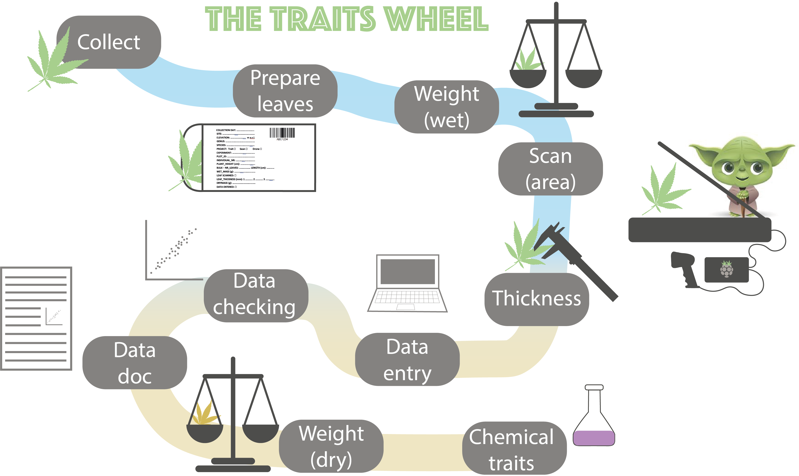
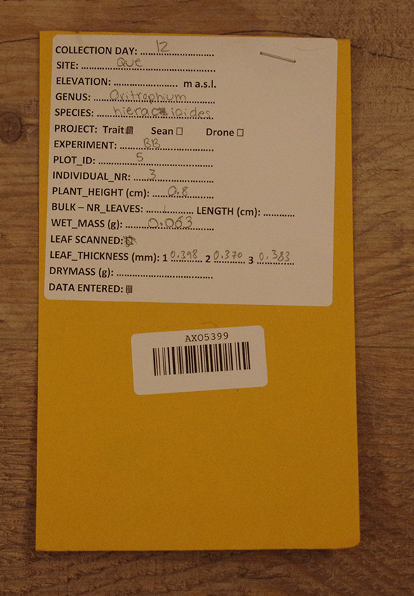

```{r, include = FALSE}
knitr::opts_chunk$set(
  collapse = TRUE,
  echo = FALSE,
  comment = "#>",
  fig.path = "man/figures/README-",
  out.width = "100%"
)

library("tidyverse")
```


# PFTCFunctions

**PFTCFunctions** is a collection of R functions used to collect plant functional traits during the Plant Functional Trait Course (PFTC).
The trait data collection is organized in multiple stations where different traits are measured, and we call it the trait wheel (see figure below).

```{r trait-wheel, fig.cap="The different stages from collection, processing and curating data from the trait wheel."}

```


The package contains the following:
- download_PFTC_data
- get_PFTC_envelope_code
- make_barcode_labels


## Installation

Install **PFTCFunctions** from [GitHub](https://github.com/) using the following code:

```{r load-package, eval = FALSE, echo=TRUE}
# install.packages("remotes")
remotes::install_github("Plant-Functional-Trait-Course/PFTCFunctions")
```


## Download PFTC data

to be added


## Make unique envelope codes

The function *get_PFTC_envelope_code* creates unique hashcodes, which we use as unique IDs for each individual leaf.
The codes are randomly created using a specific seed for each course (see table below) and contain 3 letters followed by 4 numbers.

```{r seeds, echo=FALSE}
tibble(
  Country = c("Peru", "Peru", "Svalbard", "Peru", "Norway"),
  seed = c(1, 1, 32, 6, 49),
  Campaign = c("PFTC3", "Puna", "PFTC4", "PFTC5", "PFTC6"),
  as.3.5 = c("TRUE", "TRUE", "TRUE", "TRUE", "FALSE")
) %>%
  knitr::kable()
```

The as.3.5 decides if using R > 3.5 if to use the old or new sample method. Note that for PFTC6, as.3.5 needs to be FALSE.

This is how to use the function:

```{r example, echo=TRUE}
library(PFTCFunctions)
## create list with all envelope codes. And show the first five values
all_codes <- get_PFTC_envelope_codes(seed = 1)
all_codes$hashcode[1:5]
```


## Make barcode labels

The *make_barcode_labels* function creates a PDF with barcodes from the unique IDs with can then be printed on stickers.

In the trait wheel, each sampled leaf gets an ID and is put into an envelope for further processing.
To avoid errors and simplify the process, we make barcodes from the unique IDs and produce stickers, which are put on the envelopes (see picture below).

We use the following label type:  Avery or Herma 45.7 x 21.2 mm, 48 stickers per page
For example see [here](https://www.lyreco.com/webshop/NONO/etiketter-avery-45-7-x-21-2-mm-hvit-eske-c3a0-960-stk-product-000000000002760191.html).

```{r envelope, out.width = "50%", fig.cap="Envelope with a barcode sticker."}

```

Other types and sizes of labels can be used, but the function has to be adapted.
